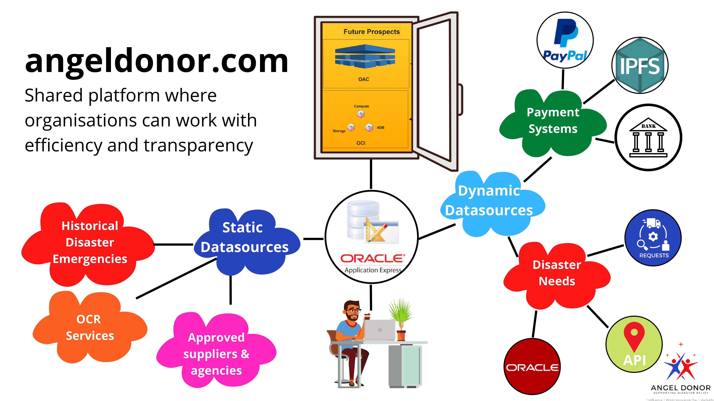
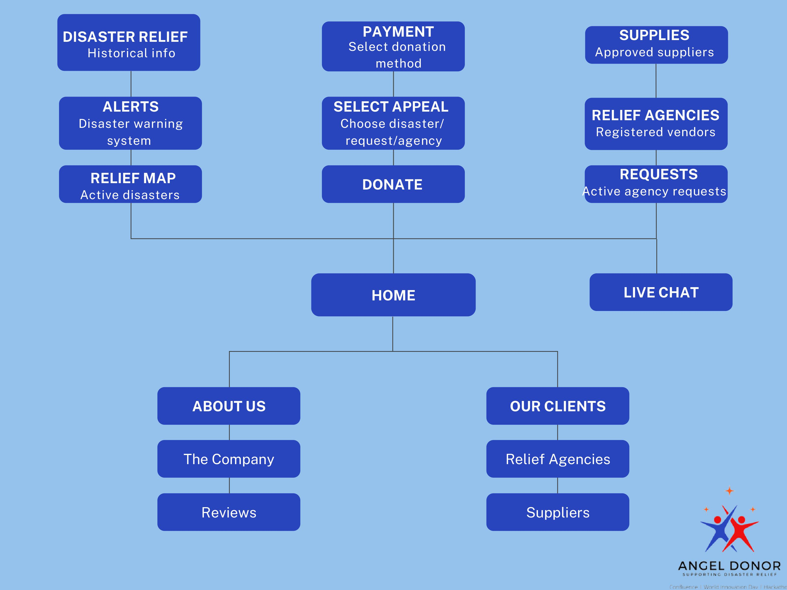

# Hackmakers_World_innovation_day_hackathon_2022
Hackmakers_World_innovation_day_hackathon_2022

Team Confluence

Angel Donor  Portal High-Level Documentation

Hackmakers
WORLD INNOVATION DAY HACK 2022

Challenge 01
Tech for Good

Presentation Link:  https://youtu.be/RT4W6e4i_4g

Repositories Link:  https://github.com/capi-go/Hackmakers_World_innovation_day_hackathon_2022

Angel Donor Portal: https://apex.oracle.com/pls/apex/r/akpan1ne46/angel-donor/home1?session=13909454454666

Problem Statement
The first 72 hours after a major natural disaster represents a crucial race against time. This is when first responders are trying to save lives, assess the damage and resettle people who have lost their homes. It is also the period when the need for supplies is most acute. Relief workers call it the disaster, after the disaster. In a rush to help, members of the public send money to the wrong people along with unwanted items and unsolicited help.
80 percent of donations are made to support disaster relief after people are moved by images in the media (Pew Research Center)
60 percent items sent to support disaster victims are discarded (UPS post disaster report)
Only 20 cents in every dollar collected helps people in need (Red Cross)

Proposed Solution
Angel Donor Portal facilitates partnership between donors, suppliers and relief workers at the disaster scene. It’s an opportunity to put UN Sustainable Development Goal number 17 to action by creating partnerships to support emergency relief efforts when disasters occur.
It is a shared platform where organizations and first responder agencies from the local, national and international level can work together in the best interests of helping those in need. 
It supports efficient resource distribution by providing line of sight to the public on what is needed to support active relief efforts. The platform works with approved humanitarian agencies who are able to make requests for donations based on the items needed in a given location:
A global map pings with requests from agencies
Members of the global community are able to donate directly to help with the cost of the request
Agencies receive direct funding from members of the public to support relief efforts

Block Diagram

Site Map

Purpose
Helping people after a disaster should be as simple as requesting an Uber. 
Angel Donor introduces transparency and accountability in the chaotic aftermath of devastating events. The global community can visit the website, see what is needed and play a direct role in moving supplies to those in need.
The best way for the global community to support relief efforts during the limited 72 hour window of opportunity is through financial contributions that make it possible to connect those most in need with the items that they require. 
Validation
Media reports and accounts from relief workers validates our problem statement. Members of the global community are compelled to help when natural disaster strikes. Despite numerous warnings from ground staff, people will find a way to send items that they think are needed or money that they believe will be useful. Humanitarian logistics expert Dale Herzog says ‘in every case, I saw how this second disaster made it nearly impossible for humanitarian responders to run efficient relief operations. The influx of donations clogged shelters, airport tarmacs and warehouses, and drained the time and energy of the willing but scarce volunteers.’

Further reading here:
Ted Ideas
The Guardian
CBS News
NPR
The Conversation
Harvard Business Review
Market Size
TAM -  $13 billion
The largest relief effort in history followed the December 26, 2004, earthquake and resulting tsunami in South Asia

SAM - $500 million
The amount of money donated is closely related to the scale of the disaster, as measured by the number of people who are killed and the number affected in other ways. Large-scale disasters affecting multiple countries attract $500 million in donations on average 

SOM - $49 million
Is the average amount donated by the public after a natural disaster

This is according to a 2021 report by the Disasters Emergency Committee

Business Model
B2C: 
Makes money from platform and transaction fees 
Donations, sponsorships and funding from the global community
Go-to-Market Plan
Sign-up 15 to humanitarian organizations in the world. These have the most effective support ecosystem according to UN data; 
- International Federation Red Cross and Red Crescent (IFRC), 
- The World Health Organization, 
- UNICEF, AmeriCares, Save the Children, 
- Catholic Relief Services, CARE International, 
- World Vision, Direct Relief, 
- World Food Programme (WFP), 
- Doctors Without Borders, 
- Action Against Hunger, 
- International Rescue Committee, 
- International Medical Corps, 
- Bangladesh Rehabilitation Assistance Committee (BRAC)

Sign-up registered humanitarian organizations operating in Asia and the Pacific, the most disaster-prone region in the world

Launch media campaign to raise awareness

Future Iterations

In the current iteration we have used an external plugin for the chatroom as proof of concept. In the next iteration we would like to build our custom chatroom. 
Also, we will customize the webpages built on Apex to make them more user friendly. 
We will also incorporate other Oracle technologies including OCI, ABD, along with compute storage and OAC for better analytics in the system.

Team Confluence*
Team Captain: Nnamse Akpan 
Project Manager: Namrah Rehman
Business Development: Kelly Silvera
UX/UI Design: Qasid Ali
Developer: Mubeen Kodvavi
Data Engineer: Umer Siddiqui
Data Scientist: Anas Siddiqui

The Mentors*
Jason Lowe,
Deepthi Gandham,
Fauzi Tahir, 
K Y Lim,
And many more.

The Sponsors*

